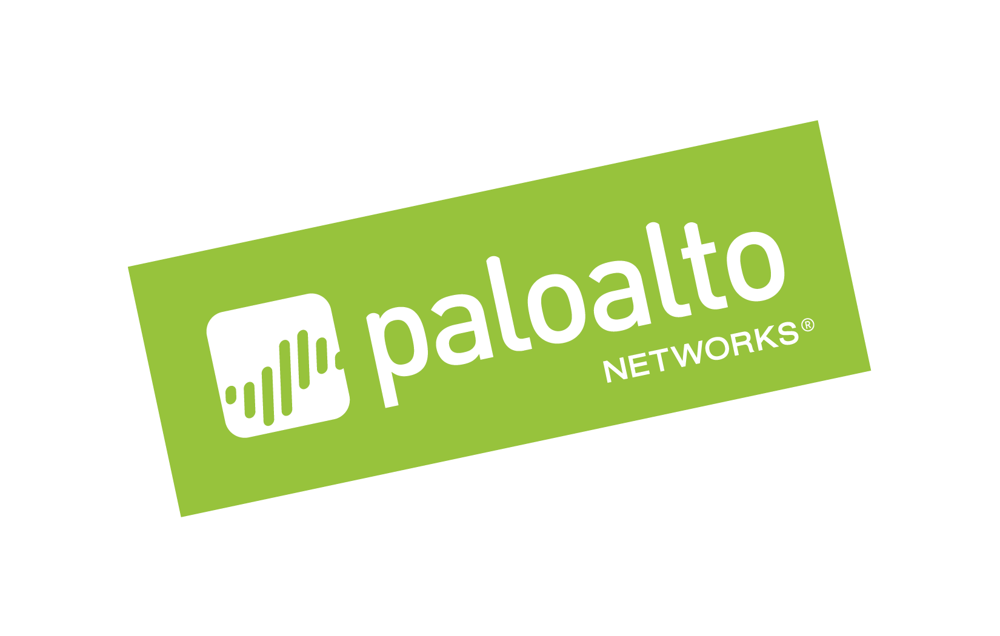
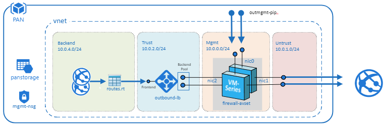
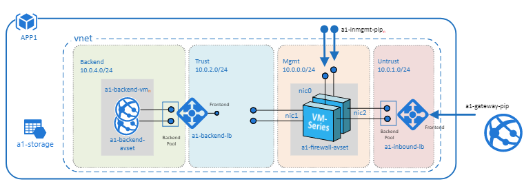

# Azure Transit VNet with the VM-Series 
Version History
- 1.0 Support for bootstrapping in hub and spoke
- 1.1 Support for auto scaling using Azure VMSS in spoke template

For more info on on Virtual Machine Scale Sets in Azure please see the VMSS Overview [Azure VMSS](https://docs.microsoft.com/en-us/azure/virtual-machine-scale-sets/overview).  
For information on how to bootstrap the VM-Series firewall running PAN-OS 8.1 and up in Azure see [Bootstrap Instructions](https://www.paloaltonetworks.com/documentation/81/virtualization/virtualization/bootstrap-the-vm-series-firewall/bootstrap-the-vm-series-firewall-in-azure#idd51f75b8-e579-44d6-a809-2fafcfe4b3b6)

The Azure Transit VNet with the VM-Series deploys a hub and spoke architecture to centralize commonly used services such as security and secure connectivity. All traffic to and from the Spokes will “transit” the Hub VNet and will be protected by the VM-Series next generation firewall. To get started, the Hub VNet must be deployed first with the Spoke VNets being deployed subsequently. Once the Spoke is deployed, the VNets are dynamically peered to allow cross VNet communication. For more information on deployment please see the [Deployment Guide](https://github.com/PaloAltoNetworks/Azure-Transit-VNet-1.1/blob/master/documentation/Azure_Transit_VNet0.1_Deployment_Guide.pdf).

# Hub VNet
The Hub VNet is deployed exclusively to handle outbound traffic that originates from within the Hub or Spoke VNet. This outbound work flow not only segments traffic that originates from outside of the VNet, but it also ensures that only whitelisted external requests are allowed by leveraging VM-Series security policies. By providing a single exit point for traffic originating within your VNets you can ensure that all outbound traffic is secured to the standards required by your organization. 

# Spoke VNet
Using the Spoke VNet template, you can deploy as many Spokes as needed to host internal only, or public facing workloads. Return traffic from inbound web access requests will traverse the same path it was received, and traffic originating from the Hub and Spoke networks will exit the hub VNet exclusively.

# Support Policy: Community-Supported
The code and templates in this repository are released under an as-is, best effort, support policy. These scripts should viewed as community supported and Palo Alto Networks will contribute our expertise as and when possible. We do not provide technical support or help in using or troubleshooting the components of the project through our normal support options such as Palo Alto Networks support teams, or ASC (Authorized Support Centers) partners and backline support options. The underlying product used (the VM-Series firewall) by the scripts or templates are still supported, but the support is only for the product functionality and not for help in deploying or using the template or script itself. Unless explicitly tagged, all projects or work posted in our GitHub repository (at https://github.com/PaloAltoNetworks) or sites other than our official Downloads page on https://support.paloaltonetworks.com are provided under the best effort policy.

